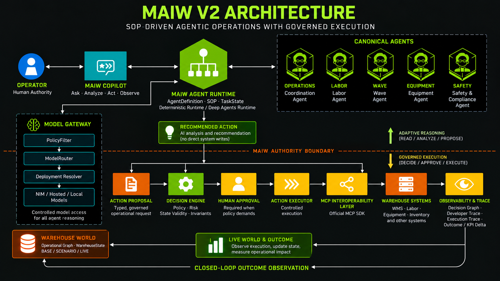

# Multi-Agent Intelligent Warehouse (MAIW)

*An NVIDIA AI Blueprint for agentic warehouse operations powered by Nemotron 3 and MCP v2.*

[](https://opensource.org/licenses/Apache-2.0)
[](https://www.python.org/downloads/)
[](https://fastapi.tiangolo.com/)
[](https://reactjs.org/)
[](https://www.nvidia.com/en-us/ai-data-science/nim/)

---

## What MAIW Is

MAIW is a multi-agent system that lets warehouse operators ask natural-language questions and issue
structured commands against live warehouse data. It does not answer from static knowledge. Instead,
each agent assembles real-time state, reasons over it with a Nemotron model, proposes a concrete
action, passes the proposal through a local decision engine, and — if approved — executes it
through an MCP v2 capability server that writes to the backend database.

The system is designed around a single non-negotiable invariant: **the LLM never touches a write
path directly**. Every mutation is proposed, evaluated by a deterministic policy engine, and
executed by a typed executor that enforces four guards before a write reaches MCP.

---

## Architecture



### Pipeline Stages

| Stage | Component | What it does |
|-------|-----------|--------------|
| **STATE** | `WarehouseStateProvider` | Assembles live snapshot of inventory, equipment, labor, and wave data via MCP read tools |
| **REASON** | `ModelGateway` → Nemotron 3 | Generates a structured action proposal — no raw text, no direct tool calls |
| **PROPOSE** | `ActionProposal` factory | Constructs a typed, immutable proposal locally; zero MCP calls at this stage |
| **DECIDE** | `DecisionEngine` | Evaluates the proposal against deterministic constraints → `APPROVED / REJECTED / DEFERRED` |
| **EXECUTE** | `BaseActionExecutor` | Enforces 4 guards, then calls the MCP write tool if all pass |
| **MCP** | `mcp_servers.<domain>.server` | Independently deployable MCP v2 server; single entry point to backend writes |
| **BACKEND** | PostgreSQL / TimescaleDB | Source of truth; no agent writes directly here |

---

## Core Design Principles

1. **LLMs propose, policy decides.** The `DecisionEngine` is synchronous, deterministic, and
   performs no I/O. It cannot be overridden by a model-generated argument.

2. **Every write passes through a typed executor.** `BaseActionExecutor` checks four guards in
   order before any MCP write tool is called: (1) decision outcome is `APPROVED`, (2) decision
   binds to the exact proposal ID, (3) action name is in the executor's static allowlist,
   (4) the decision is not stale.

3. **State is immutable once sealed.** `WarehouseStateSnapshot.seal()` assigns a UUID and freezes
   the snapshot. Proposals reference the snapshot ID; the executor performs a best-effort state
   drift check before executing.

4. **Packages have one-way dependency flow.** `maiw-models` and `maiw-mcp` have no upstream
   dependencies. `maiw-state` and `maiw-skills` depend only on those. `maiw-decision` and
   `maiw-execution` depend on skills and state. `maiw-agents` depends on all of them. Nothing
   in any canonical package imports from `src.*`.

5. **MCP is the write plane, not a chat interface.** MCP tools are not exposed to the LLM's tool
   registry. The LLM produces a proposal; the executor translates that proposal to an MCP call.

---

## Nemotron Model Gateway

All inference is routed through a centralized `ModelGateway`. Agents specify what they need
(reasoning depth, risk level, task type) — never a physical model ID.

### Model Roles

| Role | Default model | Active params | Use case |
|------|--------------|--------------|----------|
| `lightning` | `nvidia/nemotron-3.5-lightning-30b-a3b` | 3B | Fast chat, intent classification |
| `nano` | `nvidia/nemotron-3-nano-30b-a3b` | 3B | Low-latency reads, summaries |
| `super` | `nvidia/nemotron-3-super-120b-a12b` | 12B | Standard operational reasoning |
| `ultra` | `nvidia/nemotron-3-ultra-550b-a55b` | 55B | Deep analytical tasks (opt-in, slow) |

All four models are confirmed live on `integrate.api.nvidia.com/v1` (validated 2026-08-20).
The suffix `a3b / a12b / a55b` is active parameter count under the MoE architecture.

Agents use `ReasoningLevel` (`FAST / STANDARD / DEEP / ANALYTICAL`) and `RiskLevel`; the
`ModelRouter` resolves the appropriate role. Override any role via environment variable
(see [Configuration](#configuration)).

**Legacy models retired:** All `nvidia/llama-*` Nemotron model IDs return 404 or broken
responses and are no longer used. Their identifiers are preserved as `LEGACY_*` constants in
`packages/maiw-models/maiw_models/registry.py` for audit purposes only.

See [docs/architecture/MODEL_GATEWAY.md](docs/architecture/MODEL_GATEWAY.md) for full routing
policy, telemetry schema, and role-to-model override documentation.

---

## Warehouse State

`WarehouseState` aggregates live data from four domains. State assembly always precedes
proposal generation.

```python
# Agents never construct state manually — they call the provider:
state = await state_provider.get_state(
    StateRequirements(equipment=True, asset_id="FORKLIFT-07")
)
snapshot = WarehouseStateSnapshot.seal(state)  # immutable, UUID-stamped
```

| Domain | State type | Key fields |
|--------|-----------|------------|
| Inventory | `InventoryState` | SKU levels, locations, reorder flags |
| Equipment | `EquipmentState` | status, battery, assignment, location |
| Labor | `LaborState` | capacity, allocations, shift info |
| Wave | `WaveState` | active waves, priorities, risk scores |

`StateFreshness` tracks age per domain. `StateProvenance` records which MCP tool provided each
value. Stale state triggers `DEFERRED` decisions rather than silent execution with bad data.

See [docs/architecture/WAREHOUSE_STATE.md](docs/architecture/WAREHOUSE_STATE.md).

---

## Skills and Capability Contracts

Skills are stateless, typed units of work. Each skill has a defined input schema, output type,
and declared capability name. They are the only layer that generates `ActionProposal` objects.

```python
# Read skill — calls MCP, returns typed result
result = await EquipmentStatusSkill(mcp_client=client).execute(asset_id="FORKLIFT-07")

# Write skill — builds proposal locally, NO MCP call
proposal = await EquipmentAssignmentSkill().execute(asset_id="FORKLIFT-07", task_id="TASK-42")
# proposal is an ActionProposal — it describes intent, does not perform it
```

Skills live in `packages/maiw-skills/`. They do not import `src.*`, do not hold infrastructure
connections, and can be instantiated in tests without database or network access.

---

## Decision and Execution Architecture

### DecisionEngine

`DecisionEngine` takes a `DecisionRequest` (proposal + state snapshot) and returns a
`DecisionResult` with outcome `APPROVED`, `REJECTED`, or `DEFERRED`. It is synchronous and
performs no I/O. Constraint rules are deterministic Python — not LLM-evaluated.

```
DecisionRequest(proposal, snapshot)
    │
    ├── Rule 1: Proposal is structurally valid
    ├── Rule 2: Action is in the allowed capability set for this agent
    ├── Rule 3: Risk level is within domain policy
    ├── Rule 4: State is within freshness bounds
    ├── Rule 5: LOW risk + requires_approval=False → APPROVED immediately
    └── ...
    │
    ▼
DecisionResult(outcome=APPROVED|REJECTED|DEFERRED, violations=[...], rationale=...)
```

See [docs/architecture/DECISION_ENGINE.md](docs/architecture/DECISION_ENGINE.md).

### BaseActionExecutor (4-Guard Pattern)

All three domain executors (`EquipmentActionExecutor`, `LaborActionExecutor`,
`WaveActionExecutor`) inherit from `BaseActionExecutor`. Before any MCP write tool is invoked,
the executor runs four mandatory guards in order:

1. **APPROVED gate** — `decision.outcome == DecisionOutcome.APPROVED` → else `ActionNotApproved`
2. **Binding check** — `decision.proposal_id == proposal.proposal_id` → else `ActionDecisionMismatch`
3. **Action allowlist** — `proposal.action in _ALLOWED_ACTIONS` (frozenset, static) → else `ActionUnsupported`
4. **Staleness check** — decision age ≤ `max_decision_age_seconds` → else `ActionExpired`

A best-effort state-drift check follows guard 4.

### Read vs. Write Workflow

**Read (no approval required):**
```
GET /api/v1/equipment/status/{asset_id}
  → EquipmentStatusSkill → MCP read tool → PostgreSQL → JSON response
```

**Write (MEDIUM risk, requires human approval):**
```
POST /api/v1/equipment/assign
  → Agent: get_state → seal snapshot → build proposal
  → DecisionEngine: evaluate → REQUIRES_HUMAN_APPROVAL
  → Response: {executed: false, proposal_id: ..., decision_id: ...}
  # Human posts approval → executor runs guards → MCP write → executed: true
```

**Write (LOW risk, auto-executes):**
```
POST /api/v1/equipment/release
  → Agent: get_state → seal snapshot → build proposal (risk=LOW)
  → DecisionEngine: APPROVED immediately
  → EquipmentActionExecutor: 4 guards pass → MCP write
  → Response: {executed: true, execution_id: ...}
```

See [docs/architecture/RUNTIME_EXECUTION_FLOW.md](docs/architecture/RUNTIME_EXECUTION_FLOW.md)
for full sequence diagrams of all implemented paths.

---

## MCP v2 Capability Plane

MAIW uses the official MCP Python SDK (`mcp>=2.0.0,<3`, protocol version `2026-07-28`). Each
warehouse domain runs as an independently deployable MCP server.

### Architecture

```
ActionExecutor
    │
    └── MAIWMCPClient.invoke("warehouse.equipment.assign", params)
              │
              └── EquipmentMCPServer  (mcp_servers/equipment/server.py)
                        │
                        ├── MAIWEquipmentAdapter  (adapters/)
                        │
                        └── EquipmentAssetTools  → PostgreSQL
```

- Servers are **stateless HTTP** in production (`streamable-http` transport)
- Each server exposes exactly the tools in its domain contract
- MCP write tools are **not exposed to the LLM** — only the executor layer calls them
- Read tools are called by skills during state assembly

See [docs/architecture/MCP_V2_ARCHITECTURE.md](docs/architecture/MCP_V2_ARCHITECTURE.md).

---

## Implemented Warehouse Domains

MAIW implements 12 capabilities across 4 domains (7 read, 5 write):

| Domain | Capability | Name | Type |
|--------|-----------|------|------|
| **Inventory** | Get item metadata | `warehouse.inventory.get_metadata` | read |
| **Inventory** | Get stock levels | `warehouse.inventory.get_stock_levels` | read |
| **Equipment** | Get equipment status | `warehouse.equipment.get_status` | read |
| **Equipment** | Assign equipment | `warehouse.equipment.assign` | write |
| **Equipment** | Release equipment | `warehouse.equipment.release` | write |
| **Equipment** | Schedule maintenance | `warehouse.equipment.schedule_maintenance` | write |
| **Labor** | Get labor capacity | `warehouse.labor.get_capacity` | read |
| **Labor** | Get labor allocation | `warehouse.labor.get_allocation` | read |
| **Labor** | Allocate labor | `warehouse.labor.allocate` | write |
| **Wave** | Get wave status | `warehouse.wave.get` | read |
| **Wave** | Get wave risk | `warehouse.wave.get_risk` | read |
| **Wave** | Reprioritize wave | `warehouse.wave.reprioritize` | write |

See [docs/architecture/CAPABILITY_MATRIX.md](docs/architecture/CAPABILITY_MATRIX.md).

---

## Repository Structure

```
Multi-Agent-Intelligent-Warehouse/
│
├── packages/                      # Canonical Python packages (uv workspace)
│   ├── maiw-models/               # ModelGateway, NIMProvider, NIMClient, enums
│   ├── maiw-mcp/                  # Capability contracts, ActionProposal, MCP client
│   ├── maiw-state/                # WarehouseState, StateSnapshot, StateFreshness
│   ├── maiw-skills/               # Domain skills (read + write proposal factories)
│   ├── maiw-decision/             # DecisionEngine, DecisionResult, constraints
│   ├── maiw-execution/            # BaseActionExecutor, domain executors, error types
│   └── maiw-agents/               # EquipmentAssetOperationsAgent, OperationsCoordinationAgent,
│                                  #   SafetyComplianceAgent
│
├── mcp_servers/                   # Independently deployable MCP v2 servers
│   ├── inventory/                 # Inventory capability server
│   ├── equipment/                 # Equipment capability server
│   ├── labor/                     # Labor capability server
│   └── wave/                      # Wave capability server
│
├── src/api/                       # Legacy FastAPI layer (routers being migrated to apps/api)
│   ├── app.py                     # Legacy entrypoint (superseded by maiw_api.app)
│   ├── routers/                   # HTTP route handlers (canonical ones moved to apps/api)
│   ├── agents/                    # Legacy agent layer (superseded by packages/maiw-agents)
│   └── services/                  # Services: auth, DB, monitoring, legacy shims
│
├── apps/api/maiw_api/             # Canonical FastAPI entrypoint (Phase 9B)
│   ├── app.py                     # ASGI entrypoint: uvicorn maiw_api.app:app
│   ├── bootstrap.py               # MAIWRuntime composition root
│   ├── config.py                  # Application settings
│   ├── dependencies.py            # FastAPI dependency helpers
│   ├── lifespan.py                # Startup / shutdown
│   └── routers/                   # Canonical routers (health, equipment, operations, safety, mcp)
│
├── connectors/                    # Data source adapters
│   └── generic/                   # Generic WMS connector (implemented)
│
├── integrations/                  # Non-core optional subsystems
│   ├── forecasting/               # Demand forecasting (partially implemented)
│   └── document/                  # Document processing / OCR (partially implemented)
│
├── tests/
│   ├── unit/                      # Pure Python, no infrastructure (CORE CI)
│   ├── contract/                  # MCP capability contract tests (CORE CI)
│   ├── mcp/                       # MCP protocol tests, in-memory server (CORE CI)
│   └── integration/               # Requires running MAIW server + PostgreSQL
│
├── docs/architecture/             # Architecture decision records and guides
└── deploy/compose/                # Docker Compose deployment stack
```

### Package Responsibilities

| Package | Canonical import | Owns |
|---------|----------------|------|
| `maiw-models` | `from maiw_models import ModelGateway` | LLM gateway, routing, NIM provider, telemetry |
| `maiw-mcp` | `from maiw_mcp.contracts.equipment import ...` | Capability contracts, ActionProposal, MCP client |
| `maiw-state` | `from maiw_state import WarehouseState` | State assembly, snapshots, freshness, provenance |
| `maiw-skills` | `from maiw_skills.equipment import EquipmentAssignmentSkill` | Read skills, write proposal factories |
| `maiw-decision` | `from maiw_decision import DecisionEngine` | Constraint evaluation, DecisionResult |
| `maiw-execution` | `from maiw_execution import EquipmentActionExecutor` | 4-guard executor, error hierarchy, NoOp executor |
| `maiw-agents` | `from maiw_agents.equipment import EquipmentAssetOperationsAgent` | Agent orchestration, state assembly coordination |

---

## MCP Servers

Each MCP server is independently deployable and stateless.

```
mcp_servers/<domain>/
├── server.py      # FastMCP app, tool registration
├── provider.py    # Domain data provider (queries PostgreSQL)
└── adapters/      # Data adapters and transformation
```

### Starting MCP Servers

**Development (stdio transport):**

```bash
python -m mcp_servers.inventory.server
python -m mcp_servers.equipment.server
python -m mcp_servers.labor.server
python -m mcp_servers.wave.server
```

**Production (stateless HTTP):**

```bash
MAIW_MCP_TRANSPORT=streamable-http MAIW_MCP_EQUIPMENT_PORT=8766 \
    python -m mcp_servers.equipment.server

MAIW_MCP_TRANSPORT=streamable-http MAIW_MCP_LABOR_PORT=8767 \
    python -m mcp_servers.labor.server

MAIW_MCP_TRANSPORT=streamable-http MAIW_MCP_WAVE_PORT=8768 \
    python -m mcp_servers.wave.server
```

---

## Quick Start

### Prerequisites

- Python 3.11+
- PostgreSQL 14+ (or Docker)
- NVIDIA API key — get one at [build.nvidia.com](https://build.nvidia.com/)
- [uv](https://docs.astral.sh/uv/) (recommended) or pip

### Install

```bash
git clone https://github.com/NVIDIA-AI-Blueprints/Multi-Agent-Intelligent-Warehouse.git
cd Multi-Agent-Intelligent-Warehouse

# Install all workspace packages in editable mode
pip install -r requirements.txt
pip install -e packages/maiw-models
pip install -e packages/maiw-mcp
pip install -e packages/maiw-state
pip install -e packages/maiw-skills
pip install -e packages/maiw-decision
pip install -e packages/maiw-execution
pip install -e packages/maiw-agents
```

Or with uv (workspace-aware):

```bash
uv sync
```

### Docker (full stack)

```bash
cp .env.example deploy/compose/.env
# Edit deploy/compose/.env — set NVIDIA_API_KEY and POSTGRES_PASSWORD at minimum
docker compose -f deploy/compose/docker-compose.yml up
```

The stack brings up: TimescaleDB, Redis, Kafka, etcd, MinIO, Milvus, nginx, and the MAIW API.
A NIM inference server (`nvidia/nemotron-3-super-120b-a12b`) is started when a GPU profile is
active.

---

## Configuration

Copy `.env.example` to `.env` and set the required variables:

```bash
cp .env.example .env
```

### Required

| Variable | Description |
|----------|-------------|
| `NVIDIA_API_KEY` | NVIDIA API key (`nvapi-...`), from [build.nvidia.com](https://build.nvidia.com/) |
| `POSTGRES_PASSWORD` | PostgreSQL password |
| `JWT_SECRET_KEY` | JWT signing secret (min 32 chars) |

### Model Configuration

| Variable | Default | Description |
|----------|---------|-------------|
| `LLM_NIM_URL` | `https://integrate.api.nvidia.com/v1` | NIM inference endpoint |
| `LLM_MODEL` | `nvidia/nemotron-3-super-120b-a12b` | Default model ID |
| `MAIW_MODEL_LIGHTNING` | `nvidia/nemotron-3.5-lightning-30b-a3b` | Lightning role override |
| `MAIW_MODEL_NANO` | `nvidia/nemotron-3-nano-30b-a3b` | Nano role override |
| `MAIW_MODEL_SUPER` | `nvidia/nemotron-3-super-120b-a12b` | Super role override |
| `MAIW_MODEL_ULTRA` | `nvidia/nemotron-3-ultra-550b-a55b` | Ultra role override (slow, opt-in) |

### Infrastructure

| Variable | Default | Description |
|----------|---------|-------------|
| `DB_HOST` | `localhost` | PostgreSQL host |
| `DB_PORT` | `5435` | PostgreSQL port |
| `REDIS_HOST` | `localhost` | Redis host |
| `MILVUS_HOST` | `localhost` | Milvus vector DB host |

---
```
.
├─ packages/               # Canonical Python packages (import from these, not src.*)
│  ├─ maiw-mcp/            # MCP contracts, capability registry, action proposals
│  ├─ maiw-state/          # WarehouseState, domain state models (Equipment/Labor/Wave)
│  ├─ maiw-decision/       # DecisionEngine — APPROVED/REJECTED/DEFERRED outcomes
│  ├─ maiw-models/         # ModelGateway, NIM provider, ModelRequest/ReasoningLevel
│  ├─ maiw-skills/         # Inventory, Equipment, Labor, Wave skill implementations
│  ├─ maiw-execution/      # BaseActionExecutor (4-guard pattern), domain executors
│  └─ maiw-agents/         # Equipment, Operations, Safety reasoning agents
├─ apps/api/               # FastAPI application composition root (bootstrap.py)
├─ mcp_servers/            # Standalone MCP 2.0 servers (Inventory, Equipment, Labor, Wave)
├─ src/                    # Legacy source code (being migrated to packages/ above)
│  ├─ api/                 # FastAPI application (routers, agents, services)
│  ├─ retrieval/           # Retrieval services
│  ├─ memory/              # Memory services
│  ├─ adapters/            # External system adapters
│  └─ ui/                  # React web dashboard
├─ data/                   # SQL DDL/migrations, sample data
├─ deploy/                 # Deployment configurations
│  ├─ compose/             # Docker Compose files
│  ├─ helm/                # Helm charts
│  └─ scripts/             # Deployment scripts
├─ scripts/                # Utility scripts
│  ├─ setup/               # Setup scripts
│  ├─ forecasting/         # Forecasting scripts
│  └─ data/                # Data generation scripts
├─ tests/                  # Test suite
├─ docs/                   # Documentation
│  └─ architecture/        # Architecture documentation
└─ monitoring/             # Prometheus/Grafana configs
```

## Running MAIW

### API Server

```bash
uvicorn maiw_api.app:app --reload --port 8001
```

The API is available at `http://localhost:8001`. Key endpoints:

| Method | Path | Description |
|--------|------|-------------|
| `GET` | `/api/v1/health` | System health |
| `POST` | `/api/v1/chat` | Natural-language chat interface |
| `GET` | `/api/v1/equipment/status/{id}` | Equipment status (read) |
| `POST` | `/api/v1/equipment/assign` | Assign equipment (write, may require approval) |
| `POST` | `/api/v1/equipment/release` | Release equipment (write, auto-executes) |
| `POST` | `/api/v1/equipment/maintenance` | Schedule maintenance (write) |
| `GET` | `/api/v1/inventory/{sku}` | Inventory lookup (read) |
| `GET` | `/api/v1/labor/capacity` | Labor capacity (read) |
| `POST` | `/api/v1/labor/allocate` | Labor allocation (write) |
| `GET` | `/api/v1/wave/status` | Wave status (read) |
| `POST` | `/api/v1/wave/reprioritize` | Wave reprioritization (write) |

### React UI

```bash
cd src/ui/web
npm install
npm start
```

---

## Testing

MAIW uses a three-tier test structure. **CORE CI** requires no running services:

```bash
python -m pytest tests/unit/ tests/contract/ tests/mcp/ \
  --ignore=tests/unit/test_all_agents.py \
  --ignore=tests/unit/test_basic.py \
  --ignore=tests/unit/test_nvidia_llm.py \
  --ignore=tests/unit/test_caching_demo.py \
  --ignore=tests/unit/test_response_quality_demo.py \
  --ignore=tests/unit/test_mcp_integrated_planner_graph.py \
  --ignore=tests/unit/test_chunking_demo.py \
  --ignore=tests/unit/test_db_connection.py \
  --ignore=tests/unit/test_enhanced_retrieval.py \
  --ignore=tests/unit/test_evidence_scoring_demo.py \
  --ignore=tests/unit/test_mcp_system.py \
  --ignore=tests/unit/test_guardrails.py \
  --ignore=tests/unit/test_guardrails_sdk.py \
  --ignore=tests/unit/test_mcp_planner_integration.py \
  --ignore=tests/unit/test_nvidia_integration.py \
  --ignore=tests/unit/test_document_action_tools.py \
  --ignore=tests/unit/test_document_pipeline.py \
  --ignore=tests/unit/test_embedding.py \
  --ignore=tests/unit/test_reasoning_evaluation.py \
  --ignore=tests/unit/test_prompt_injection_protection.py \
  --ignore=tests/unit/test_prompt_injection_simple.py
```

**Baseline (Phase 9A): 528 passed, 1 skipped, 0 failed**

| Test tier | Command | Requires |
|-----------|---------|---------|
| CORE CI | Command above | Python packages only |
| Integration | `pytest tests/integration/` | Running MAIW server + PostgreSQL |
| External service | Set `NVIDIA_API_KEY`, remove `--ignore` flags | NVIDIA API key + NIM endpoint |

See [docs/architecture/TEST_STRATEGY.md](docs/architecture/TEST_STRATEGY.md) for per-file
exclusion rationale and historical baselines by phase.

---

## Architecture Invariants

These invariants are enforced by the test suite and must not be broken:

| Invariant | Enforcement |
|-----------|------------|
| LLM cannot call MCP write tools directly | No MCP write tool in any agent tool registry |
| Proposals are built locally, never via MCP | `ActionProposal` factories have no MCP client |
| DecisionEngine is synchronous, no I/O | `evaluate()` has no `await`, no client dependencies |
| Only `ActionExecutor.execute()` reaches MCP writes | Single call-site per domain executor |
| Action names are statically allowlisted | `_ALLOWED_ACTIONS` is a `frozenset` literal |
| No canonical package imports from `src.*` | AST scanner in `test_package_imports.py` |
| No canonical package imports heavy infra deps | AST scanner: `asyncpg`, `pymilvus`, `redis`, `fastapi` forbidden |
| `maiw-execution` does not import `maiw-agents` | Cycle prevention enforced in test suite |

---

## Modernization Status

MAIW is in active modernization from a legacy LangGraph/monolith architecture to a typed,
package-based, MCP v2 system.

| Area | Status | Notes |
|------|--------|-------|
| **ModelGateway** (`maiw-models`) | ✅ Done | Nemotron 3 roles, routing policy, NIM provider, telemetry |
| **WarehouseState** (`maiw-state`) | ✅ Done | Snapshot sealing, freshness, provenance, all 4 domains |
| **Skills** (`maiw-skills`) | ✅ Done | Read skills, write proposal factories, all 4 domains |
| **DecisionEngine** (`maiw-decision`) | ✅ Done | All constraint rules, APPROVED/REJECTED/DEFERRED |
| **Executors** (`maiw-execution`) | ✅ Done | 4-guard BaseActionExecutor, Equipment + Labor + Wave |
| **Agents** (`maiw-agents`) | ✅ Done | Equipment, Operations, Safety agents in canonical packages |
| **MCP v2 servers** | ✅ Done | Inventory, Equipment, Labor, Wave — stateless HTTP |
| **Capability contracts** | ✅ Done | All 12 capabilities defined, contract-tested |
| **Compatibility shims** | ⚠️ Remove in Phase 10 | `src/api/services/model_gateway/__init__.py`, `src/api/skills/*.py` |
| **Forecasting integration** | 🔄 Partial | `integrations/forecasting/` — multi-model ensemble, not wired to agents |
| **Document processing** | 🔄 Partial | `integrations/document/` — OCR + extraction, not wired to agents |
| **Simulation** | 🔲 Future | `integrations/simulation/` — placeholder only |
| **Optimization** | 🔲 Future | `integrations/optimization/` — placeholder only |
| **Training / flywheel** | 🔲 Future | `integrations/training/` — placeholder only |
| **SAP EWM connector** | 🔲 Future | `connectors/` — generic connector implemented; SAP planned |
| **Manhattan / Blue Yonder** | 🔲 Future | Planned WMS connectors |
| **apps/api as entrypoint** | ✅ Phase 9B | `maiw_api.app:app` is the canonical entrypoint; `MAIWRuntime` is the composition root |

---

## Documentation

| Document | Description |
|----------|------------|
| [MODEL_GATEWAY.md](docs/architecture/MODEL_GATEWAY.md) | Nemotron roles, routing policy, telemetry |
| [WAREHOUSE_STATE.md](docs/architecture/WAREHOUSE_STATE.md) | State assembly, freshness, provenance |
| [CAPABILITY_MATRIX.md](docs/architecture/CAPABILITY_MATRIX.md) | All 12 capabilities, read/write classification |
| [DECISION_ENGINE.md](docs/architecture/DECISION_ENGINE.md) | Constraint rules, outcome model |
| [RUNTIME_EXECUTION_FLOW.md](docs/architecture/RUNTIME_EXECUTION_FLOW.md) | Full pipeline sequence diagrams |
| [MCP_V2_ARCHITECTURE.md](docs/architecture/MCP_V2_ARCHITECTURE.md) | MCP SDK, protocol version, deployment |
| [DEPENDENCY_BOUNDARIES.md](docs/architecture/DEPENDENCY_BOUNDARIES.md) | Package boundary rules |
| [PACKAGE_OWNERSHIP.md](docs/architecture/PACKAGE_OWNERSHIP.md) | Module-to-package ownership map |
| [TEST_STRATEGY.md](docs/architecture/TEST_STRATEGY.md) | CORE CI command, exclusion rationale, baselines |

---

## Contributing

1. Fork the repository and create a feature branch.
2. All changes must keep CORE CI green: 528 passed, 1 skipped.
3. New canonical code goes in `packages/`, never in `src.*` for business logic.
4. No `src.*` imports in any `packages/` code — enforced by the test suite.
5. Commit messages must follow [Conventional Commits](https://www.conventionalcommits.org/).

---

## License

Apache License 2.0. See [LICENSE](LICENSE) for full text.

Copyright (c) 2025 NVIDIA CORPORATION & AFFILIATES. All rights reserved.
